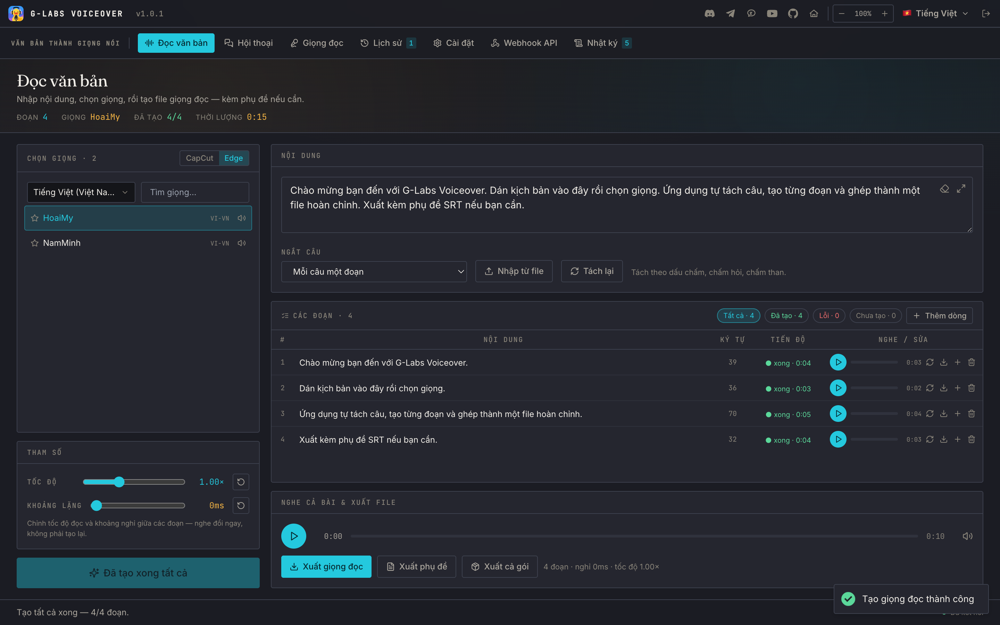
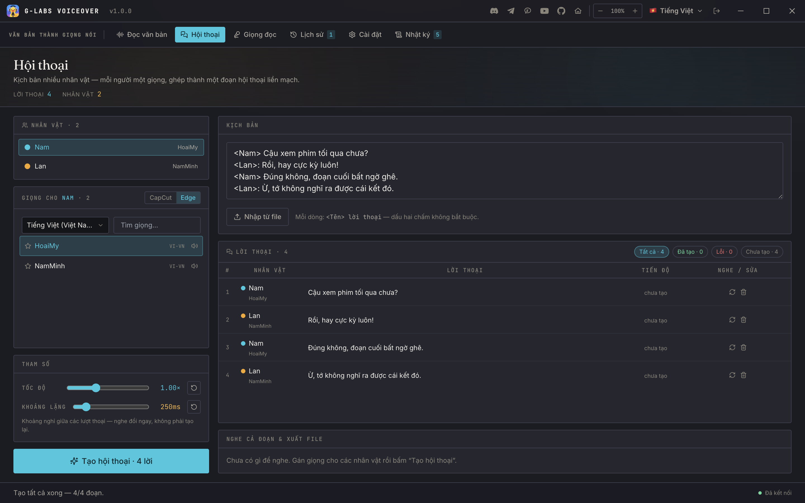
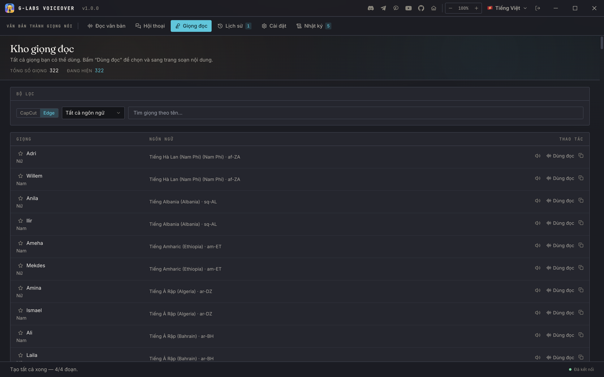
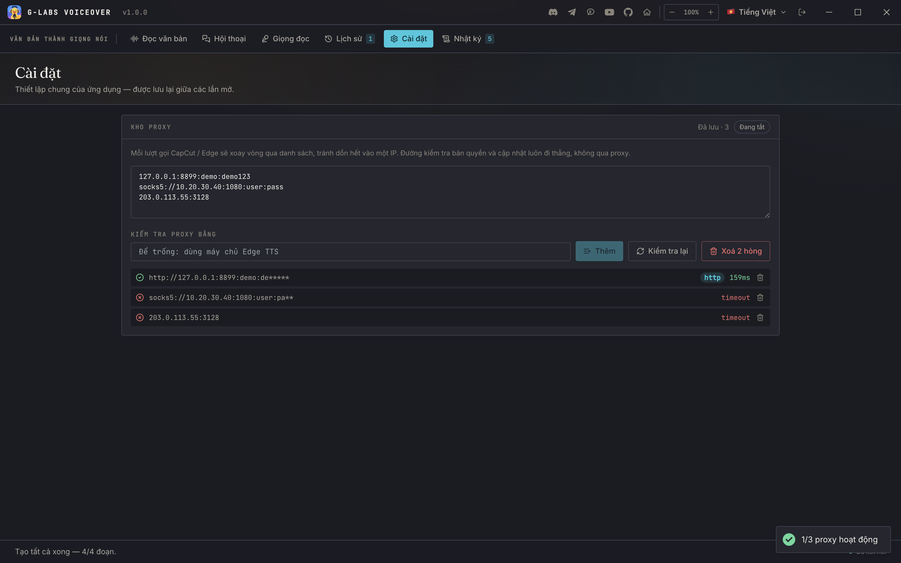
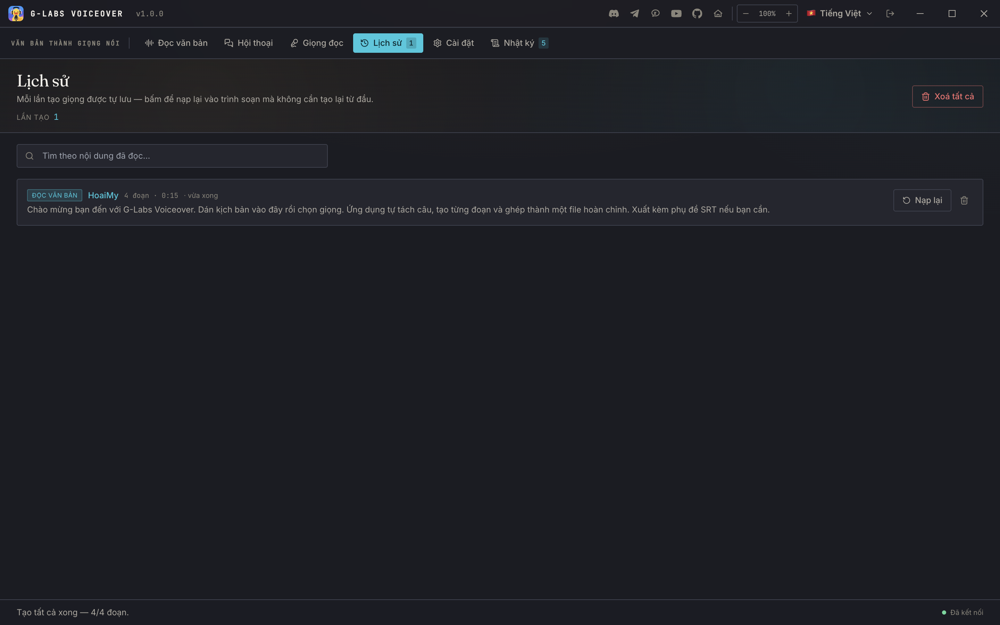
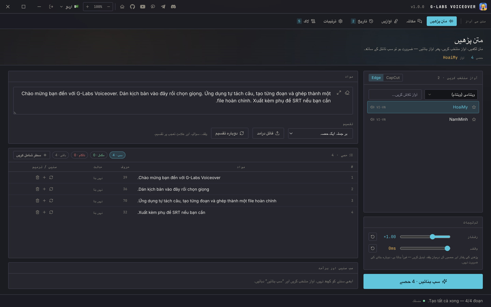

# G-Labs Voiceover

**English** | [Tiếng Việt](README.vi.md)

Desktop app that turns a script into a finished voice-over — **two TTS engines in one place**: CapCut's voices and Microsoft Edge read-aloud (**322 neural voices across 142 locales**). Paste text, pick a voice, get one merged MP3 plus matching SRT subtitles. ffmpeg ships inside; nothing else to install.

## Features

- **Two engines, one workflow**: switch between **CapCut** and **Microsoft Edge** without changing anything else — same table, same params, same exports. Edge is free and has no quota, so it doubles as the pressure valve when CapCut throttles
- **Sentence-aware splitting**: one segment per sentence, per line, or **smart-pack** to an N-character budget — every segment generates, replays, regenerates and downloads on its own
- **Import .txt / .srt**: an SRT import keeps each cue's timing, and **"fit to subtitle"** speeds each line (never slows, capped at 1.8×) to land on its original cue — the merged audio matches the subtitle timeline
- **Dialogue mode**: write `<Name> line` per line, assign a voice per character, and the whole conversation generates as one task with per-block voices; export keeps the speaker name in the SRT
- **Speed & gap without regenerating**: the speed and silence-gap sliders re-merge locally — no new API calls, no quota spent
- **Exports**: merged MP3, SRT, or both in a ZIP. Filenames carry an index, the first words and a timestamp, so nothing ever overwrites an earlier save
- **Voice preview**: every voice has a bundled sample you can hear before spending anything — multilingual voices carry one per language, native voices one in their own
- **Proxy pool**: paste proxies in any format (`host:port:user:pass`, `user:pass@host:port`, `socks5://…`, IPv6) into a saved list; CapCut/Edge requests rotate through it round-robin. **Re-check** probes each one, auto-detects its type (HTTP/SOCKS4/SOCKS5) and flags the dead ones — then remove them in one click. Passwords are masked in the list
- **Everything is remembered**: script, segment table, chosen voice, speed, gap, favourites, UI zoom, language and the open tab all survive a relaunch — stored in the OS app-data folder, not localStorage
- **Whole-UI zoom** (70–140%) in the title bar — real reflow, so zooming out fits more on screen instead of only shrinking text
- **Generation history**: every run is auto-saved, searchable by content, and reloads into the editor it came from
- **11 languages**: Tiếng Việt, English, हिन्दी, Türkçe, Português, 简体中文, اردو (RTL), বাংলা, Русский, Español, ไทย
- **App auto-update** from GitHub Releases, in-app

## Screenshots

| Dialogue — a voice per character | Voice catalog (322 Edge voices) |
|---|---|
|  |  |

| Proxy pool (auto-detect, masked passwords) | Generation history |
|---|---|
|  |  |

| Right-to-left (اردو) |
|---|
|  |

## Which engine should I use?

| | CapCut | Microsoft Edge |
|---|---|---|
| Voices | 121 | **322** across 142 locales |
| Quota | limited per window | none |
| Best for | CapCut-native timbre | volume work, rare languages |

Some CapCut voices are one **multilingual** model rather than a native speaker — they carry a 🌐 marker, because on a non-primary language they read with a slight accent. Native voices sound natural; the marker lets you pick knowingly.

## Install

Grab the latest from [Releases](https://github.com/duckmartians/G-Labs-Voiceover/releases):

- **Windows**: `GLabsVoiceover-<version>-setup.exe`
- **macOS (Apple Silicon)**: `GLabsVoiceover-<version>-arm64.dmg` — unsigned; first open: right-click → Open, or `xattr -dr com.apple.quarantine "/Applications/G-Labs Voiceover.app"`

Settings live in the OS per-user data folder (`%APPDATA%\G-Labs Voiceover` on Windows, `~/Library/Application Support/G-Labs Voiceover` on macOS).

## Requirements

A **G-Labs account with a paid plan on any tool** (Lite or above), or a valid Voice add-on. Sign in with the Google account linked to G-Labs — the app opens your system browser. See [plans & tools](https://duckmartians.info).

Voice endpoints are delivered by the licence server per session and held in memory only; nothing about them ships inside the app.
