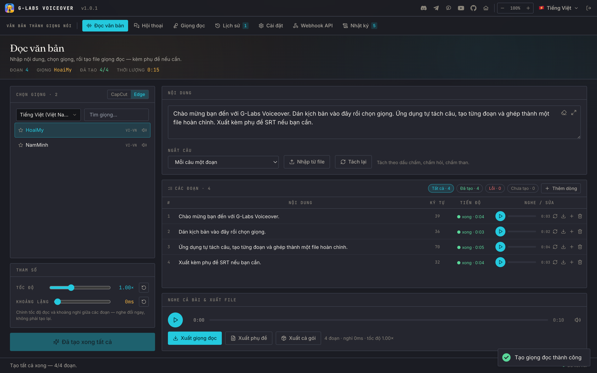
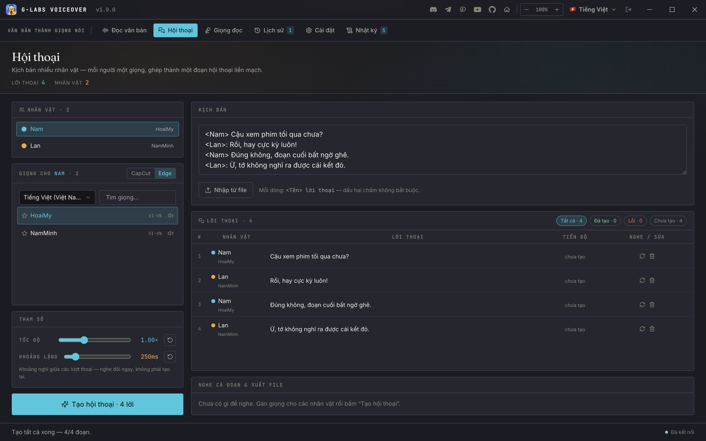
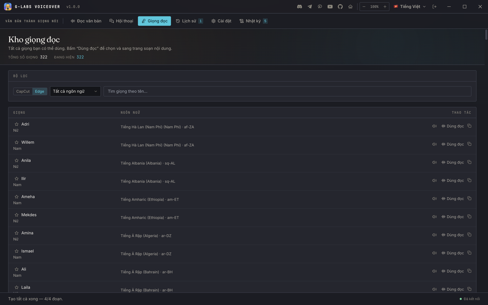
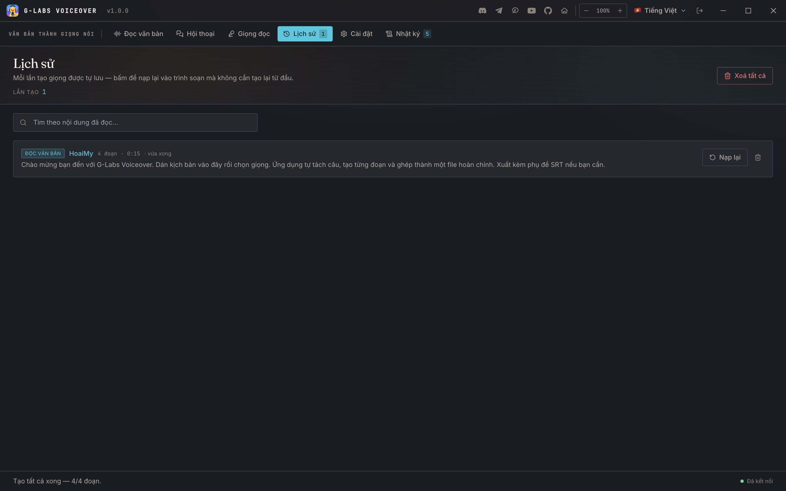
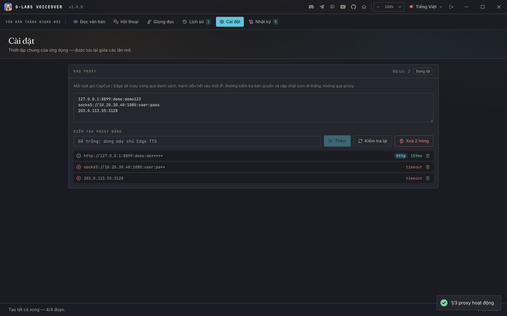
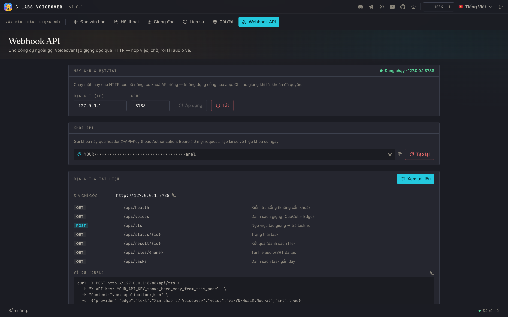
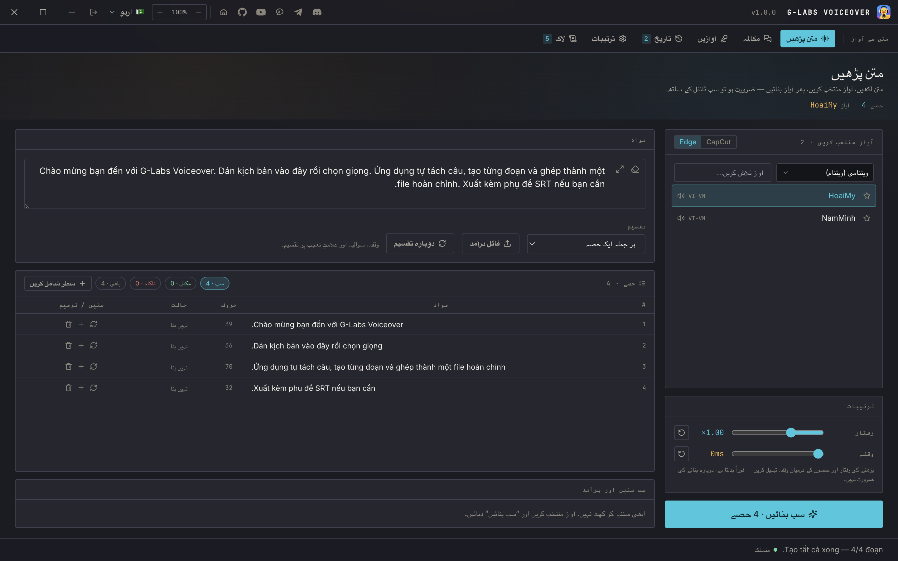

<h1 align="center">G-Labs Voiceover</h1>

<p align="center"><b>Ứng dụng desktop biến kịch bản thành file giọng đọc hoàn chỉnh - giọng CapCut và 322 giọng Microsoft Edge trong một chỗ, xuất ra một file MP3 đã ghép kèm phụ đề SRT khớp thời lượng.</b></p>

<p align="center">
  <a href="README.md">English</a> ·
  <b>Tiếng Việt</b>
</p>

<p align="center">
  <a href="https://github.com/duckmartians/G-Labs-Voiceover/releases/latest"></a>&nbsp;
  <a href="https://github.com/duckmartians/G-Labs-Voiceover/releases/latest"></a>
</p>

---

## Cài đặt

### Bước 1 - Chọn đúng bản cho máy của bạn

Tải bản mới nhất từ **[Releases](https://github.com/duckmartians/G-Labs-Voiceover/releases/latest)**, rồi chọn tệp theo đúng máy:

| Máy của bạn | Tải tệp | Ghi chú |
|---|---|---|
| 🪟 **Windows (64-bit)** | [`GLabsVoiceover-<phiên-bản>-setup.exe`](https://github.com/duckmartians/G-Labs-Voiceover/releases/latest) | Bộ cài đặt |
| 🍎 **Mac chip Apple (M1/M2/M3/M4)** | [`GLabsVoiceover-<phiên-bản>-arm64.dmg`](https://github.com/duckmartians/G-Labs-Voiceover/releases/latest) | Chỉ cho Apple Silicon |

> **Không có bản cho Mac chip Intel** - tệp `arm64` sẽ không mở được trên máy Intel.

### Bước 2 - Cài đặt

<details open>
<summary><b>🪟 Trên Windows</b></summary>

1. Mở tệp **`GLabsVoiceover-<phiên-bản>-setup.exe`** vừa tải.
2. Nếu hiện bảng **"Windows protected your PC"** (SmartScreen): bấm **More info** → **Run anyway**. *(App chưa mua chứng chỉ ký của Microsoft nên bị cảnh báo - không phải virus.)*
3. Làm theo trình cài đặt - bạn chọn được thư mục cài. App cài cho tài khoản người dùng hiện tại và tạo lối tắt ở **Start Menu** và **Desktop**.
4. Mở **G-Labs Voiceover** từ Start Menu hoặc lối tắt trên Desktop.

</details>

<details open>
<summary><b>🍎 Trên macOS</b></summary>

1. Mở tệp **`.dmg`** vừa tải, rồi **kéo biểu tượng G-Labs Voiceover thả vào thư mục Applications**.
2. Vào **Applications**, **bấm chuột phải** (hoặc giữ Control rồi bấm) lên **G-Labs Voiceover** → chọn **Open** → bấm **Open** lần nữa ở hộp xác nhận. *(App chưa được Apple ký nên phải mở kiểu này ở **lần đầu**; những lần sau mở bình thường như mọi app.)*
3. Nếu macOS báo **"bị hỏng / không thể mở"** hoặc không thấy nút Open, mở **Terminal** và dán lệnh sau rồi Enter:
   ```bash
   xattr -dr com.apple.quarantine "/Applications/G-Labs Voiceover.app"
   ```
   Sau đó mở lại app.

</details>

### Bước 3 - Đăng nhập (quyền dùng đi kèm gói G-Labs)

**Voiceover không bán riêng.** App mở khoá cho **tài khoản của bạn đang có gói trả phí ở bất kỳ công cụ G-Labs nào (từ gói Lite trở lên)**, hoặc có gói **G-Labs Voice Studio** (add-on Voice) còn hạn. Gói Basic miễn phí không mở được. Xem [các gói & công cụ](https://duckmartians.info).

Bấm **Đăng nhập với Google** bằng tài khoản Google đã liên kết với gói G-Labs - app mở trình duyệt hệ thống để đăng nhập. Máy chủ giấy phép xác nhận gói mỗi lần mở app và tiếp tục kiểm tra lại trong lúc app chạy; khi gói gốc hết hạn, app khoá lại. Cấu hình dịch vụ giọng chỉ được gửi cho phiên đủ quyền, nên **cả hai bộ máy (CapCut và Edge) đều cần tài khoản đủ điều kiện**.

Ứng dụng **tự cập nhật** từ GitHub Releases: trên Windows nó tải bộ cài mới rồi chạy; trên macOS nó tải `.dmg` mới và mở ra để bạn kéo vào Applications.

---

## Lần chạy đầu tiên

1. **Mở app và đăng nhập bằng Google** với tài khoản của bạn có gói trả phí.
2. **Mở tab Đọc văn bản** và dán kịch bản - hoặc **Nhập từ file** để nạp `.txt` hay `.srt`.
3. **Chọn cách ngắt câu** (mỗi câu, mỗi dòng, hoặc gộp thông minh theo số ký tự), chọn bộ máy **CapCut** hoặc **Microsoft Edge** và một **giọng**.
4. Bấm **Tạo tất cả**. Nghe từng đoạn và tạo lại đoạn nào chưa ưng.
5. Chỉnh **tốc độ** và **khoảng lặng** giữa các đoạn nếu cần, rồi **Xuất giọng đọc** (MP3), **Xuất phụ đề** (SRT) hoặc **Xuất cả gói** (ZIP gồm cả hai).

---

## Tính năng



- **Hai bộ máy, một quy trình** - chuyển qua lại **CapCut** và **Microsoft Edge** mà không đổi gì khác: cùng bảng đoạn, cùng thiết lập, cùng cách xuất. Edge không giới hạn lượt, nên còn là lối thoát khi CapCut bị siết.
- **Tách câu thông minh** - mỗi câu một đoạn, mỗi dòng một đoạn, hoặc **gộp thông minh** theo số ký tự; từng đoạn tự tạo, nghe lại, tạo lại và tải riêng.
- **Nhập .txt / .srt** - nhập SRT giữ nguyên mốc thời gian từng câu, và **"khớp thời lượng phụ đề"** tăng tốc câu nào dài hơn ô của nó (chỉ tăng, tối đa 1.8×) để audio ghép ra bám đúng timeline phụ đề.
- **Chế độ Hội thoại** - viết `<Tên> lời thoại` mỗi dòng, gán một giọng cho mỗi nhân vật, cả đoạn hội thoại tạo trong một lượt; SRT xuất ra giữ tên nhân vật.
- **Đổi tốc độ & khoảng lặng không cần tạo lại** - hai thanh trượt tốc độ và khoảng nghỉ chỉ ghép lại tại máy: không gọi dịch vụ, không tốn lượt.
- **Xuất file** - MP3 đã ghép, SRT, hoặc cả gói ZIP. Tên file có số thứ tự, vài chữ đầu và thời gian, nên bản xuất mới không bao giờ ghi đè bản cũ.
- **Nghe thử giọng** - mỗi giọng có mẫu sẵn để nghe trước khi tạo; giọng đa ngôn ngữ có mẫu cho từng thứ tiếng.
- **Kho proxy** - dán proxy đủ định dạng; mỗi lượt gọi CapCut/Edge xoay vòng qua danh sách, có nút kiểm tra lại để nhận diện loại proxy và đánh dấu cái hỏng.
- **Webhook API** (tuỳ chọn bật) - máy chủ HTTP cục bộ để script và AI agent điều khiển (xem bên dưới).
- **Ghi nhớ công việc** - bản nháp kịch bản, bảng đoạn, giọng đã chọn, tốc độ, khoảng lặng, giọng yêu thích, mức zoom, ngôn ngữ và tab đang mở đều còn nguyên sau khi tắt mở lại.
- **Zoom toàn giao diện** (70-140%) ngay trên titlebar, bố cục co giãn thật.
- **Đóng gói sẵn ffmpeg** - không cần cài gì thêm, không cần GPU.
- **11 ngôn ngữ giao diện** - Tiếng Việt, English, हिन्दी, Türkçe, Português, 简体中文, اردو (phải-sang-trái), বাংলা, Русский, Español, ไทย.

### Nên dùng bộ máy nào?

| | CapCut | Microsoft Edge |
|---|---|---|
| Số giọng | 121 | **322**, 142 ngôn ngữ/vùng |
| Giới hạn | có hạn mức mỗi phiên | không |
| Hợp cho | chất giọng đặc trưng CapCut | làm số lượng lớn, ngôn ngữ hiếm |

Một số giọng CapCut là **một model đa ngôn ngữ** chứ không phải người bản xứ - chúng có nhãn 🌐, vì khi đọc ngôn ngữ không phải tiếng gốc sẽ hơi lơ lớ. Giọng bản địa nghe tự nhiên; nhãn này để bạn chọn cho đúng ý.

---

## Các trang

### 🔊 Đọc văn bản


Không gian làm việc chính. Dán hoặc nhập kịch bản, chọn cách ngắt câu, bộ máy và giọng, rồi **Tạo tất cả**. Mỗi dòng trong bảng đoạn nghe, tạo lại và tải riêng được. Khi đã nhập SRT, bật **khớp thời lượng phụ đề** để mỗi câu nằm đúng mốc gốc. Khung **Nghe cả bài & xuất file** phát bản đã ghép và xuất MP3, SRT hoặc cả gói ZIP.

### 💬 Hội thoại



Viết cuộc hội thoại theo dạng `<Tên> lời thoại`, mỗi dòng một câu, rồi gán giọng cho từng nhân vật. Cả đoạn hội thoại tạo trong một lượt với giọng riêng từng khối, và SRT xuất ra giữ tên người nói.

### 🎙 Giọng đọc



Kho giọng - 322 giọng Edge và 121 giọng CapCut. Nghe thử từng giọng bằng mẫu có sẵn và đánh dấu yêu thích; giọng CapCut đa ngôn ngữ có nhãn 🌐.

### 🕘 Lịch sử



Mỗi lượt tạo tự lưu trong phiên làm việc hiện tại, tìm được theo nội dung, và nạp lại đúng tab đã tạo ra nó.

### ⚙️ Cài đặt - kho proxy



Dán proxy đủ định dạng (`host:port:user:pass`, `user:pass@host:port`, `socks5://…`, IPv6) vào danh sách lưu; mỗi lượt gọi CapCut/Edge xoay vòng lần lượt qua danh sách. **Kiểm tra lại** dò từng proxy, tự nhận diện loại (HTTP / SOCKS4 / SOCKS5) và đánh dấu cái hỏng để xoá một nhát. Mật khẩu được che trong danh sách.

### 🌐 Webhook API



Bật tab **Webhook API**, Voiceover chạy một máy chủ HTTP cục bộ nhỏ (mặc định `127.0.0.1:8788`) để công cụ của bạn - hoặc một AI agent - gọi:

```bash
curl -X POST http://127.0.0.1:8788/api/tts \
  -H "X-API-Key: <khoá lấy trong panel>" -H "Content-Type: application/json" \
  -d '{"provider":"edge","text":"Xin chào","voice":"vi-VN-HoaiMyNeural","srt":true}'
# → { "task_id": "…" }  → chờ GET /api/status/{id}  → tải ở /api/files
```

Nộp `text` hoặc mảng `segments`, nhận một file `master.mp3` đã ghép (kèm file từng đoạn và SRT nếu yêu cầu). Xác thực bằng khoá API riêng do app tự sinh mỗi máy; chỉ sinh giọng khi tài khoản đủ quyền; máy chủ bind `127.0.0.1` trừ khi bạn mở ra mạng LAN. Tài liệu đầy đủ - mọi endpoint, trường body và cấu trúc phản hồi - nằm ở **[WEBHOOK.md](WEBHOOK.md)**, viết để một AI agent đọc là tích hợp được ngay.

### 🌍 Giao diện phải-sang-trái



Giao diện đổi được giữa 11 ngôn ngữ; tiếng Urdu (اردو) dùng bố cục phải-sang-trái hoàn chỉnh.

---

## Nơi lưu dữ liệu

| Gì | macOS | Windows |
|---|---|---|
| Thiết lập, bản nháp kịch bản, danh sách proxy, khoá webhook (`prefs.json`), phiên đăng nhập và mã thiết bị | `~/Library/Application Support/G-Labs Voiceover` | `%APPDATA%\G-Labs Voiceover` |
| File đầu ra của Webhook | `$TMPDIR/voiceover-webhook-files` | `%TEMP%\voiceover-webhook-files` |

Văn bản của bạn được gửi tới dịch vụ giọng CapCut hoặc Microsoft Edge (qua proxy nếu bạn đã cài) để đọc. Máy chủ giấy phép G-Labs chỉ dùng để đăng nhập và kiểm tra quyền dùng.

---

## Khắc phục sự cố

**"Tài khoản chưa đủ điều kiện" sau khi đăng nhập** - tài khoản chưa có gói G-Labs trả phí còn hạn (từ Lite trở lên) hoặc add-on Voice. Mua hoặc gia hạn gói rồi bấm **Thử lại**.

**"Không kết nối được máy chủ"** - app chưa liên hệ được máy chủ giấy phép. Kiểm tra mạng rồi bấm **Thử lại**.

**"Đã đạt giới hạn thiết bị cho tài khoản này"** - tài khoản đã dùng hết số thiết bị mà máy chủ giấy phép cho phép.

**CapCut ngừng tạo hoặc báo hết lượt** - CapCut giới hạn số lượt mỗi phiên. Chuyển bộ máy sang **Microsoft Edge** (không giới hạn), hoặc thêm proxy trong **Cài đặt**.

**Windows chặn ở "Windows protected your PC"** - bấm **More info → Run anyway**. App chưa mua chứng chỉ ký nên bị cảnh báo, không phải virus.

**macOS báo ứng dụng bị hỏng / không mở được** - app chưa được Apple ký. Chuột phải → **Open** ở lần đầu, hoặc chạy `xattr -dr com.apple.quarantine "/Applications/G-Labs Voiceover.app"`.

**Bản cập nhật không cài được** - tải bản mới nhất thủ công từ [Releases](https://github.com/duckmartians/G-Labs-Voiceover/releases/latest).
